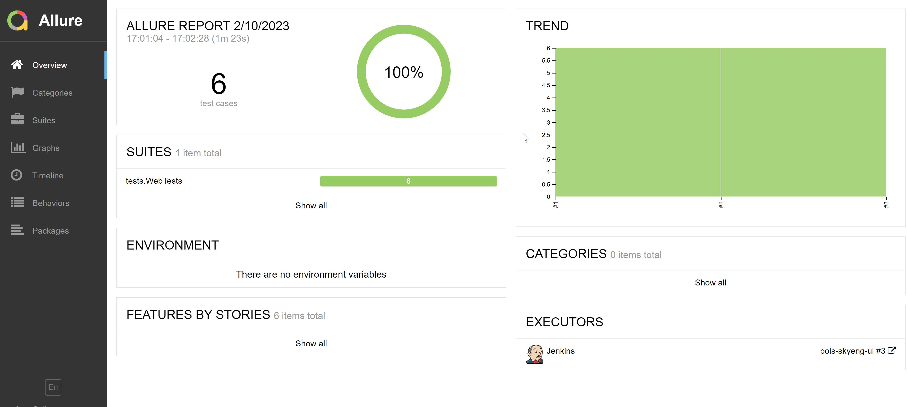
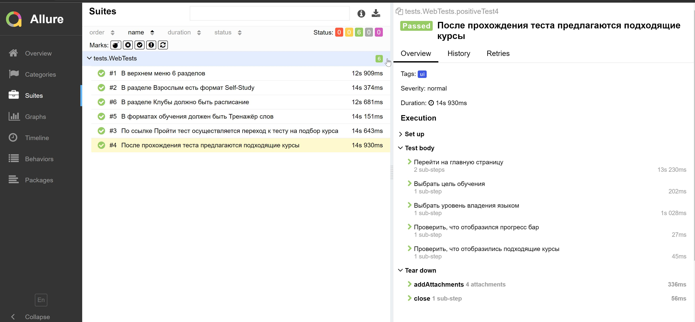
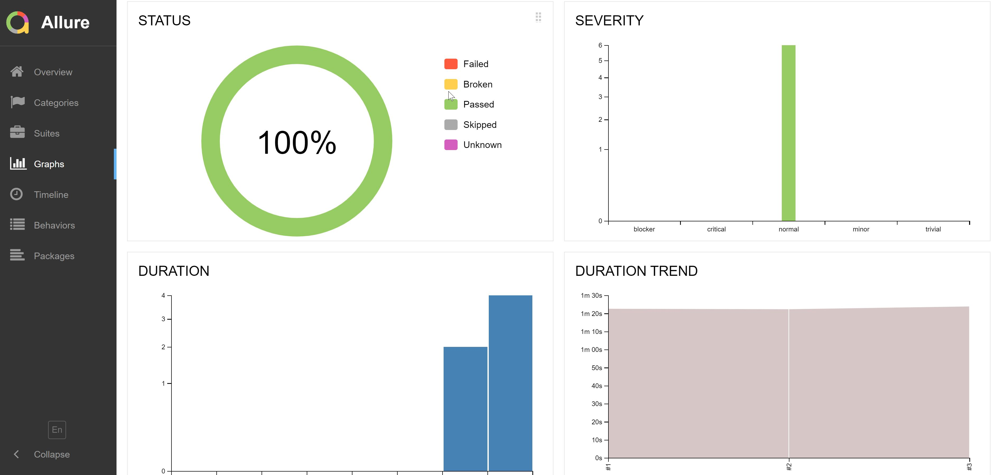
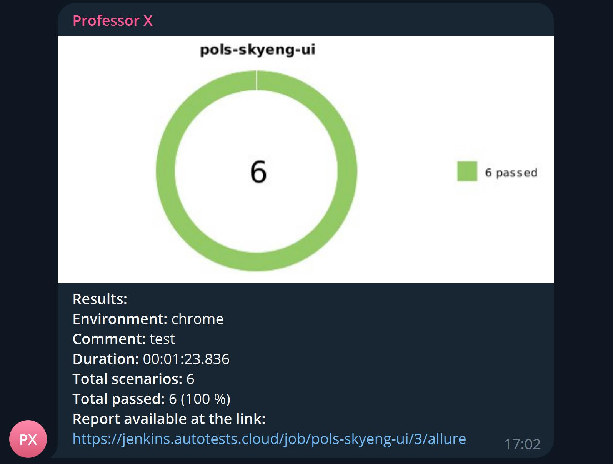
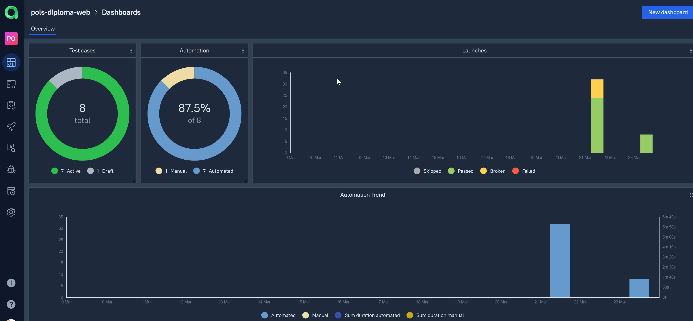
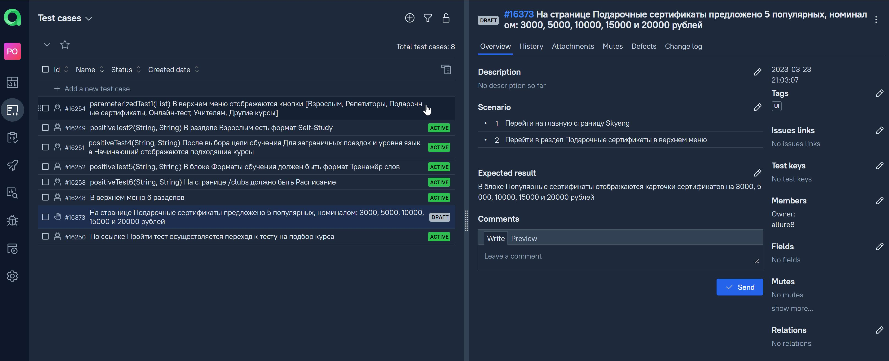

# Проект по автоматизации тестирования WEB
<p align="center">
<a href="https://skyeng.ru"></a>
</p>
## :card_file_box: Содержание
- [Технологии и инструменты](#bookmark-технологии-и-инструменты)
- [Запуск из терминала](#bookmark-запуск-тестов-из-терминала)
- [Сборка в Jenkins](#bookmark--jenkins--job-)
- [Allure отчет](#bookmark--отчет-в-allure-report)
- [Уведомление в Telegram](#bookmark--уведомление-в-telegram)
- [Видео прохождения тестов](#bookmark--видео-прохождения-некоторых-тестов)
- [Allure TestOps](#bookmark--добавление-интеграции-с-allure-testops)

## :bookmark: Технологии и инструменты
<p align="center">
<a href="https://www.jetbrains.com/idea/"></a>
<a href="https://www.java.com/"></a>
<a href="https://github.com/"></a>
<a href="https://junit.org/junit5/"></a>
<a href="https://gradle.org/"></a>
<a href="https://selenide.org/"></a>
<a href="https://aerokube.com/selenoid/"></a>
<a href="https://github.com/allure-framework/allure2"></a>
<a href="https://www.jenkins.io/"></a>
<a></a>
<a></a>
</p>

## :bookmark: Запуск тестов из терминала
Локальный запуск:
```
gradle clean ui_test -Denv=local
```

Удаленный запуск:
```
clean
ui_test
-Denv=${remote}
```
## :bookmark: </a> Jenkins <a target="_blank" href="https://jenkins.autotests.cloud/job/pols-diploma-web/"> job </a> 

## :bookmark: </a> Отчет в <a target="_blank" href="https://jenkins.autotests.cloud/job/pols-diploma-web/5/allure/">Allure report</a>

### Обзор сборки
<p align="center">

</p>

### Тесты
<p align="center">

</p>

### :bar_chart: Графики
<p align="center">

</p>

## :bookmark: </a> Уведомление в Telegram

<p align="center">

</p>

## :bookmark: </a> Видео прохождения некоторых тестов

### Тест #3 По ссылке Пройти тест осуществляется переход к тесту на подбор курса
<p align="center">
  
</p>

### Тест #4 После прохождения теста предлагаются подходящие курсы
<p align="center">
  
</p>

## :bookmark: </a> Добавление интеграции с Allure TestOps
<a target="_blank" href="https://allure.autotests.cloud/project/2060/jobs">Job</a>

### Allure TestOps dashboard
<p align="center">
  
</p>

### Добавление ручных тестов
<p align="center">
  
</p>
